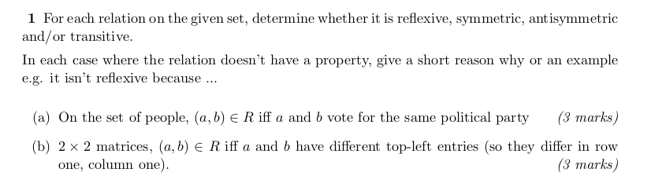

### a)
\[ R = \{(a,a),(b,b),(a,b),(b,a)\} \]

- **Reflexive:** 
  - The relation is reflexive as (a,a) and (b,b) are present. This means that an element is related to itself.
  - _Example_: (a votes for the same party as themselves).

- **Symmetric:** 
  - The relation is symmetric because if (a,b) is in R, then (b,a) is also in R.
  - _Example_: If `a` voted for party `x` and `b` voted for party `x`, then they are related both ways.

- **Not Asymmetric:** 
  - The relation is not asymmetric because if (a,b) is in R, then (b,a) is also in R. In an asymmetric relation, both (a,b) and (b,a) cannot be true unless a = b.

- **Transitive:** 
  - The relation is transitive. If (a,b) and (b,c) are in R, then (a,c) must also be in R. 
  - _Example_: If (a,b) and (b,c), then (a,c) holds true.

### b)
\[ R = \{(a,b),(b,a)\} \]

- **Not Reflexive:** 
  - The relation is not reflexive because (a,a) and (b,b) are not present. Reflexivity requires that every element be related to itself.
  - _Example_: The condition of being different in the top left prevents reflexivity.

- **Symmetric:** 
  - The relation is symmetric because if (a,b) is in R, then (b,a) is also in R.

- **Not Antisymmetric:** 
  - The relation is not antisymmetric because both (a,b) and (b,a) are present, but a ≠ b. In an antisymmetric relation, if both (a,b) and (b,a) are in R, then a must be equal to b.

- **Not Transitive:** 
  - The relation is not transitive. If (a,b) and (b,c) are in R, it does not necessarily mean (a,c) is in R.
  - If (a is different from b) and (b is different from c), there is a possibility of a and c being the same, which breaks transitivity.
  - 
  - 
    
